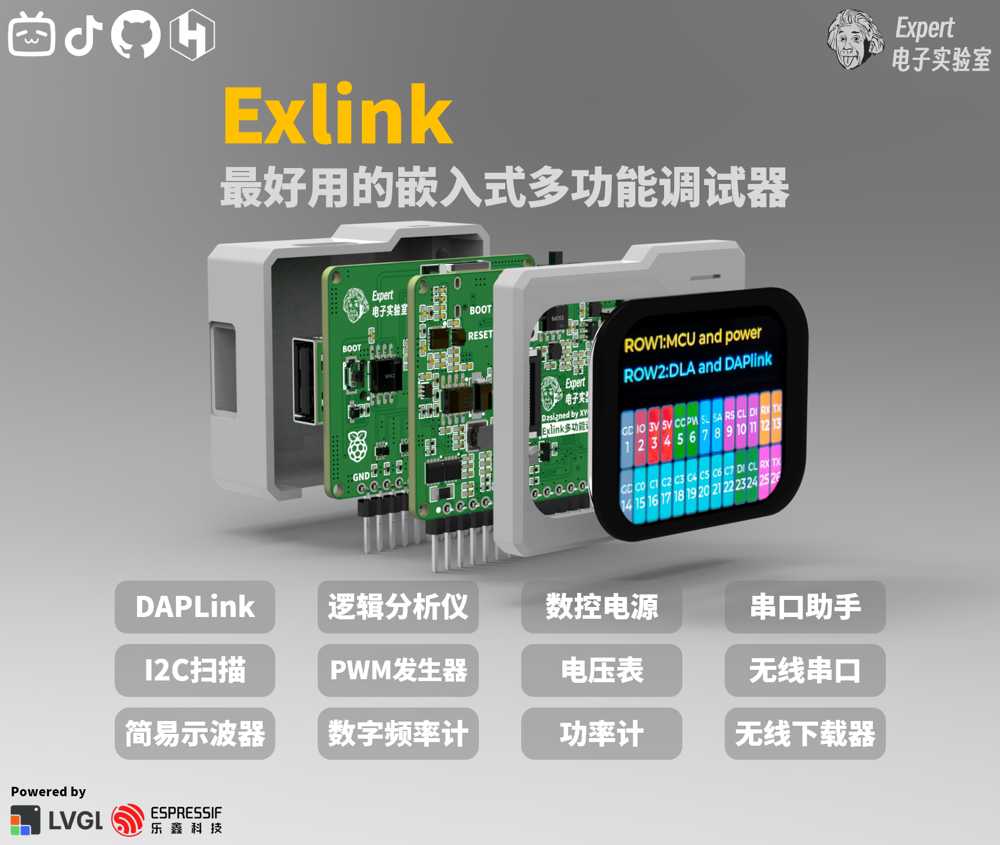
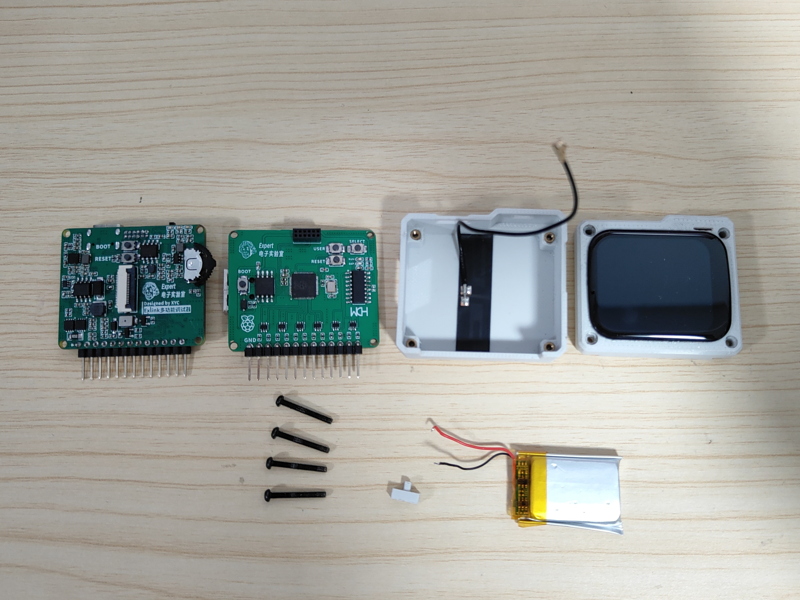
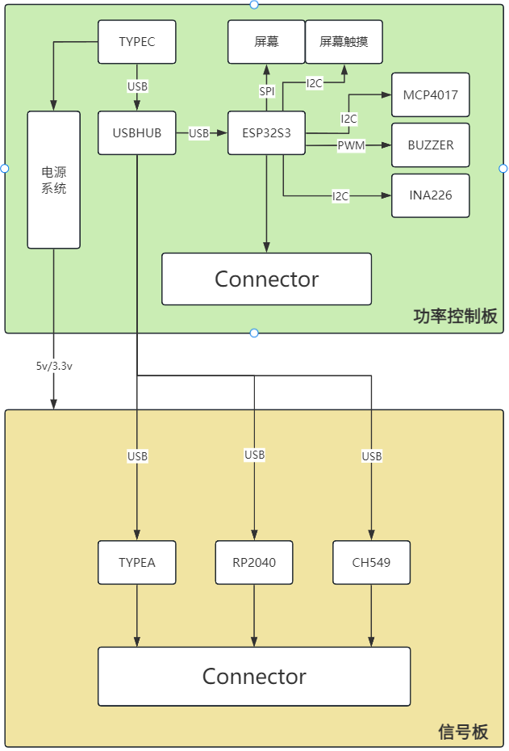
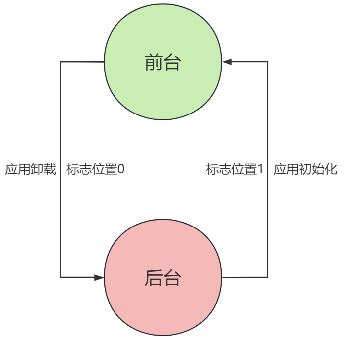
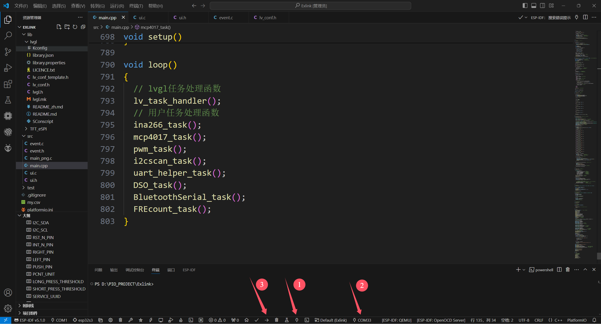
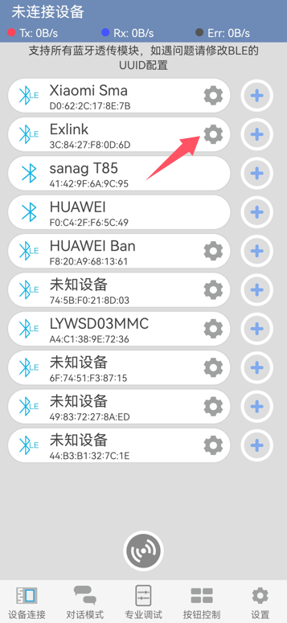
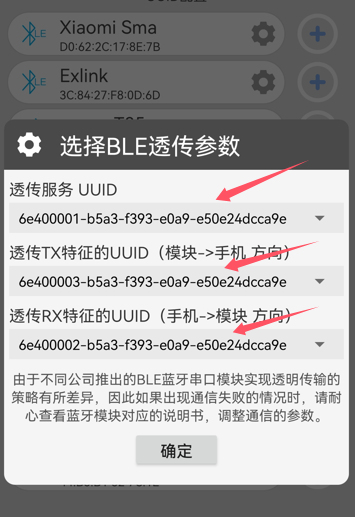
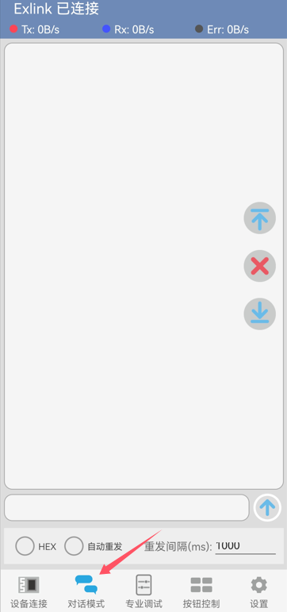

## 声明：请遵守开源协议，禁止商用，转载请注明出处
# 项目简介：为什么要做这个嵌入式调试器工具？
在本人学习嵌入式和做项目的过程中，一直存在几个痛点：
- 嵌入式调试工具冗杂，且一般一个模块只能实现一个功能，接线杂乱
- 笔记本接口普遍较少，不接拓展坞的情况下难以插接多个调试模块
- 大学生学习嵌入式时难以配齐所有工具，且部分工具价格较高

所以为了解决这些问题，我耗时三个月，基于ESP32S3和LVGL，制作了这款多功能嵌入式调试工具，具有DAPlink、逻辑分析仪、串口助手、数控电源、无线下载器、无线串口、电压表、i2c扫描、PWM输出、简易示波器、数字频率计等十余种不同的功能，涵盖了大部分嵌入式的调试场景，实测可以有效且优雅地解决以上的痛点，最关键的是，所有器件均采用容易购买且性价比高的器件，制作成本控制在百元以内。
# 产品渲染图

# 产品实物图

## 外观

## 内部结构

## 引脚功能界面

## 数控电源界面

## 无线串口界面

# 硬件说明
## 系统框图：

## PCB结构：
项目由两块PCB构成，电源控制板为四层板，信号板为两层板，采用分立叠板设计，通过1.27mm排针连接
- 电源控制板：主要负责调试器与电脑的通信、数控电源、简易示波器、屏幕显示、无线下载器等功能
- 信号板：主要负责逻辑分析仪和DAPlink等功能
## 关于系统电源：
项目的电源输入存在三种情况：电脑usb的5v输入、使用pd充电器的12v诱骗电压输入、使用内部电池输入。

首先考虑前两种情况，电源由typec接口输入后分为两路，一路经由MP28167变换为5v送入ip5306电池充放电管理芯片，为3.7v锂电池充电的同时提供5v电压，经过SY8120B变换为3.3v为各个芯片供电；另一路经由TPS5450提供数控可调电源，需要注意的是，使用数控电源时需要12v的诱骗电压，所以必须要配合支持pd诱骗的充电器使用。

## 关于数控电源和电压测量：
项目实现数控电源的方法是基于数字电位器和功率监测芯片实现的，通过数字电位器作为电源芯片的反馈电阻，单片机通过i2c协议控制数字电位器的阻值来控制输出电压，INA226将测得的功率数据反馈给单片机。

这里在数控电源的输出控制端采用了双PMOS背靠背连接的电路，实现了电源的双向关断，所以我们可以通过关闭双PMOS实现外界输入的电压测量，打开双PMOS时则是内部的数控电源向外输出。

## 关于USB：
项目采用CH334F将一路usb信号拓展至四路，其中ESP32S3、RP2040和CH549G各连接一路，另外的一路由一个usbA口引出，可以外接usb设备同时为开发板或者手机供电。

## 关于元件选型：
- 主控采用ESP32S3主要是看重单片机的无线能力，ESP32S3内置有低功耗蓝牙和wifi模块，可以实现无线串口和无线下载器的功能，240MHz的主频可以实现较快的数据处理。

- FLASH内存芯片采用W25Q128JVPIQ，从ESP32S3的数据手册得知ESP32S3最大支持外挂16MB也就是128Mb的FLASH芯片，这里直接上最大的容量，SRAM直接使用单片机内部自带的PSRAM空间共8MB。

- 逻辑分析仪采用的是基于树莓派RP2040的方案，支持八通道（原方案是24通道，本项目引出了八通道）最大100MHz采样率，外挂FLASH为W25Q16JVSSIQ，2MB容量。

- DAPLink采用的是CH549G的方案，支持ARM和RISCV单片机下载调试，支持一路usb虚拟串口。理论上DAPLink和逻辑分析仪都可以使用ESP32S3来实现，采用分立器件实现这两个功能成本较高，但好处是可以通过USBHUB并行使用这些功能。

- 功率监测芯片采用的是INA226，最大支持20v的电压测量，我这里使用的采样电阻为0.05欧姆，改变采样电阻会改变采样电流分辨率，同时需要修改电流计算部分的代码。

- 屏幕采用的是1.69寸的电容触摸屏，驱动芯片为ST7789V（spi接口），触摸驱动为CST816T（i2c接口），采样排线插接的方式安装。

- 天线采用IPEX座插接的2.4g天线，为了保证信号质量，需要将天线贴在外壳底面，实测无线信号良好，连接稳定。

## 关于电路防护：
项目所有的外接IO口均使用ESD器件和限流电阻保护，防止静电击穿，电源供电部分串联自恢复保险丝，防止过流。

## 关于焊接：
焊接顺序建议为：电源控制板->信号板

优先焊接电源部分，电源部分测试通过后焊接其他部分，推荐使用热风枪加锡膏进行焊接。

# 软件说明

项目的软件基于VScode+PIO，移植了LVGL作为UI界面，整体代码逻辑为状态机+前后台。

## 代码结构
Exlink项目文件夹下包含以下几个文件：

### .pio        （pio配置文件）
### .vscode     （vscode配置文件）
### build       （编译生成的文件）
### include     （包含的头文件）
### lib         （包含的库文件）
- Arduino-CST816T-Library （CST816T库）
- INA-master（INA226库）
- lvgl（lvgl库）
- TFT_eSPI（屏幕驱动库）
### src（源文件）
- main.cpp（主程序文件）
- ui.c（ui文件）
- ui.h（ui头文件）
- main_png.c（图片数组文件）
- event.c（事件回调文件）
- event.h（事件回调头文件）
### test        （测试文件）
### .gitignore  （屏蔽文件）
### my.csv      （ESP32S3内存分配表） 
### platformio.ini（pio项目配置文件）

## 切换逻辑

我们首先将整个调试器的功能划分为几个应用，以数控电源为例，当我们未启动这个应用时，应用此时处于后台状态，标志位为0，不占用系统资源，当我们选中这个应用时（如点击这个应用图标），标志位置1，系统执行一系列初始化（如加载应用界面，数字电位器初始化，功率计初始化等），应用进入前台运行，当我们取消任务时，系统执行一些列关闭操作（如失能通信接口，关闭定时器，关闭应用界面等），标志位置0，应用重新回到后台。

如果前后台任务冲突，可能会导致单片机内存报错重启。

# 结构说明

调试器外壳采用3D打印制作，总共需要打印三个部分：顶壳，底壳，开关，底壳上需要用电烙铁压入M2热熔螺母，屏幕可以使用502胶粘在顶壳上，开关结构件需要插入开关柄内，固定螺丝使用四颗16mmM2螺丝拧入即可。
# 固件下载和烧录
本项目的三颗主控芯片（ESP32S3、RP2040、CH549）需要分别烧录固件：

- ESP32S3烧录：首先需要在vscode安装platformio插件，使用vscode打开software文件夹中的Exlink文件，vscode会自动安装ESP32S3编译环境（时间可能会比较久），之后按住电源控制板上的boot按键插上板子的usbtypec接口，插上后松开boot按键，ESP32S3会加入下载模式，然后选择对应的com口，点击下载，下载完成后复位即可。
 

- RP2040烧录：按住信号板上的boot键插入USB，电脑就能识别成U盘，然后把pico_sdk_sigrok.uf2固件复制进去即可。具体使用方法参考:
[RP2040逻辑分析仪](https://blog.csdn.net/qq1003155077/article/details/130841838?ops_request_misc=%257B%2522request%255Fid%2522%253A%252257B0188D-17C5-4AC1-99E7-A6468258EC39%2522%252C%2522scm%2522%253A%252220140713.130102334..%2522%257D&request_id=57B0188D-17C5-4AC1-99E7-A6468258EC39&biz_id=0&utm_medium=distribute.pc_search_result.none-task-blog-2~all~baidu_landing_v2~default-6-130841838-null-null.142^v100^pc_search_result_base6&utm_term=%E6%A0%91%E8%8E%93%E6%B4%BEpico%E9%80%BB%E8%BE%91%E5%88%86%E6%9E%90%E4%BB%AA&spm=1018.2226.3001.4187)
- CH549烧录：选中CH549的usb接口，使用WCHISPTool烧录固件即可。具体使用方法参考:https://oshwhub.com/hhh89/wch-link-v2
- 如果需要使用无线下载器功能需要重新烧录ESP32S3固件。具体使用方法参考：https://yunsi.studio/wireless-proxy/online-flasher

# 使用说明
- 使用数控电源功能时需要配合支持PD协议的充电器连接双c口线使用。
- 使用串口助手和无线串口时需要在串口发送端的串口数据末尾加上换行符“/n”。
- 无线串口需要配合手机蓝牙调试器APP使用，用手机显示蓝牙串口信息。
具体方法为：下载蓝牙调试器APP：https://gitee.com/xie-rongji/bt_mcu
打开Exlink的无线串口功能，在蓝牙调试APP中选中Exlink，由于使用的是低功耗蓝牙，所以需要在APP中选择服务的uuid，之后点击连接打开调试界面即可看到串口发送的信息。

# 参考资料
本项目参考了很多开源资料，在此表示感谢：

- LVGL：https://github.com/lvgl
- 正点原子LVGL开发指南：http://www.openedv.com/docs/index.html
- RP2040逻辑分析仪项目：https://github.com/gusmanb/logicanalyzer
- 基于CH549的DAPlink项目：https://oshwhub.com/hhh89/wch-link-v2
- 多功能调试器设计：https://github.com/physicsexpert/felini-firmware
- 稚晖君peak项目：https://github.com/peng-zhihui/Peak
- 显示屏相关设计：https://oshwhub.com/eedadada/monica
- 基于ESP32S3的无线下载器：https://github.com/windowsair/wireless-esp8266-dap
- ESP32S3固件在线烧录：https://yunsi.studio/wireless-proxy/online-flasher
- 蓝牙调试器APP开源：https://gitee.com/xie-rongji/bt_mcu

此外，很多同学也对本项目提出了宝贵的意见，在此也表示感谢：

- 刘文俊同学对电源相关设计提出的意见
- 孟祥钦同学对功能需求提出的意见
- 陈家辉同学对功能需求提出的意见
- 张皓顺同学对无线下载器提出的意见
- 崔骏彦同学提供的测试工具

