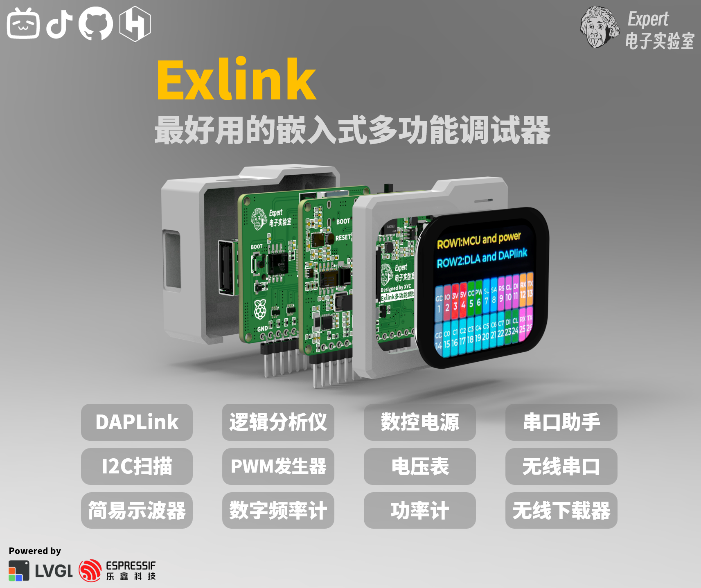

## 声明：请遵守开源协议，禁止商用，转载请注明出处
# 项目简介：为什么要做这个嵌入式调试器工具？
在本人学习嵌入式和做项目的过程中，一直存在几个痛点：
- 嵌入式调试工具冗杂，且一般一个模块只能实现一个功能
- 笔记本接口普遍较少，不接拓展坞的情况下难以插接多个调试模块
- 大学生学习嵌入式时难以配齐所有工具，且部分工具价格较高

所以为了解决这些问题，我耗时三个月，基于ESP32S3和LVGL，制作了这款多功能嵌入式调试工具，具有DAPlink、逻辑分析仪、串口助手、数控电源、无线下载调试器等十余种不同的功能，涵盖了大部分嵌入式的调试场景，实测可以有效且优雅地解决以上的痛点，最关键的是，所有器件均采用容易购买且性价比高的器件，制作成本控制在百元以内
# 产品渲染图

